# GTFreeFlyer's WWII Carrier Recovery Script for DCS World
This script is for DCS World and has two main functions:  
  1. It will grade your landings on the WWII Essex Carriers only (this is not for modern carriers)
  2. It will make aircraft carrier groups automatically turn into the wind and adjust speed to provide a user-specified WOD (Wind Over Deck) whenever aircraft of the same coalition are detecct within X miles
  
More details are below...

## PLEASE NOTE:
The script is not yet available to public. You will not find it in this repository, so don't bother with the download and installation sections below quite yet. For a limited time, it is only available to play with on vCTF-58's server. The Virtual Carrier Task Force 58's aim is to recreate the Pacific War as accurately as possible through extensive research and mission building. Please visit the Discord here: https://discord.gg/yU9taPJC8X

## Table of Contents
* [Features](#features)
* [Download](#download)
* [Installation](#installation)
* [Flying the Pattern](#flying-the-pattern)
* [Technical Info. for Scoring](#technical-info-for-scoring)
* [Carrier Auto-Turn Into the Wind](carrier-auto-turn-into-the-wind)
* [Contact Info](#contact-info)
* [Forum Thread](#forum-thread)
* [Support Me](#support-me)
* [Credits](#credits)

## Features

### Carrier Recovery Grading Features:
* Tracks your progress around the boat, starting with the initial starboard pass, all the way until catching a wire and clearing the deck quickly.
* Tracks multiple carriers and pilots. For example, you can have 4 planes landing at each of the 10 carriers in your mission and everyone will be graded.
* All players see a one-line message with your score.  Only you see the detailed printout of your stats after landing.
* Carrier landing pattern is in accordance with USF-77, "Current Tactical Orders, Aircraft Carriers U.S. Fleet", March 1941
* Detects which wire you caught, bolters, noseovers, skidding to a stop, etc.
* Some additional scoring parameters have been added to help make you a better pilot
  
### Carrier Auto-Turn Into the Wind Feature:
* Aircraft carrier groups automatically turn into the wind and adjust speed to provide a user-specified WOD (Wind Over Deck) whenever aircraft of the same coalition are detected within X miles, below Y feet. (X,Y are user-defined)
* No waypoint tricks are required in the Mission Editor. The script will override whatever waypoints you have set up and send the aircraft carrier group upwind, then will restore the original waypoint plan once all aircraft have left the airspace, and resume to the waypoint it was previously heading to.
* When a player enters a carrier group's airspace, a text message appears letting pilots know the group is turning into the wind, and gives them the expected BRC and current altimeter setting.
* Works by taking a measurement of the current wind speed, wind direction, temperature and pressure at the carrier's current location at the time it needs to turn into the wind.
* The actual alignment into the wind is not direct, but instead is 5 degrees off to the right in accordance with historical documentation showing this was done to keep turbulence from the island away from the landing area.
* This feature now gives mission designers the flexibily to do whatever they want with wind, cyclones, etc, along with keeping a carrier group orbiting in a small area at slow speed.  Previously, designers had to keep wind constant across the entire map and send carrier groups in a straight line in order to provide consistent WOD conditions.
  
### Other:
* When using this lua script inside your own missions, it will automatically detect any Essex carriers, and any planes in the carrier's airspace or entering the pattern. No setup required. Just drop the script in (see installation guide below)
* Both features above have settings to exclude specific carrier groups and/or specific carrier units. See Step 7 below for the two settings you need.
* Included with the download is:
   * a .miz ready to fly and practice your landings
   * the lua script itself which is drop-in-ready for your own missions, no lua setup required
  
## Download
Source: https://github.com/GTFreeFlyer/DCS_WWII_Carrier_Recovery
   * Please click the Watch button and Star button at the top of the GitHub page to receive notices when there are updates.  
   * Please click Issues at the top of the GitHub page to report bugs and request new features.  
1. From the GitHub page, click Releases on the right side, and click DCSWWIICarrierRecovery_v1.zip to download it. (You do not need to download the Source code zip or tar.gz).    
2. Extract the .zip anywhere you like on your PC
3. If you don't already have MIST downloaded to your PC, I have included it in the .zip for you, or get the latest version from https://github.com/mrSkortch/MissionScriptingTools if you use MIST for other things. You only need the single file, mist.lua.  There's no need to download the whole .zip from mrSkortch's GitHub. Click on mist.lua from the list of files you see; this will bring you to the page that shows all 9500+ lines of code.  Press ctrl+shift+S to save the file somewhere on your PC.

## Installation 
(THE ORDER OF THESE TRIGGERS MATTERS!)

4. Create the 1st trigger:  
TYPE: ONCE, NAME: Load MIST
CONDITIONS: TIME MORE, 1 second
ACTION 1: DO SCRIPT FILE - Navigate to where you saved mist.lua and select it.  

5. Create the 2nd trigger:  
TYPE: ONCE, NAME: Load Grading Script 
CONDITIONS: TIME MORE, 5 seconds  (we want to wait a few seconds to make sure all the units have populated in the mission)
ACTIONS: DO SCRIPT FILE - Navigate to the extracted DCSWWIICarrierRecovery folder and select 'GTFreeFlyers WWII Recovery v1.0.lua' (or whatever the latest version number is).  
You do not need to open or edit the .lua file. Just load it into the mission.

6. Create the 3rd trigger (optional, and recommended, if you want the sound effects):  
TYPE: ONCE, NAME: Load Sounds  
CONDITIONS: FLAG EQUALS, Flag: 999, Value: 999 (we are creating a flag that will never execute, but this is what is required to load the sounds into the .miz)
ACTIONS: SOUND TO ALL - Navigate to the extracted DCSWWIICarrierRecovery folder and select one of the .ogg files from soundEffects folder. Create another action and select another .ogg from that folder. Repeat until all .ogg files are loaded.  

## Setup
Wait, I said no setup is required!  
Well, that's true, but I know people like to tweak some things on their own, so I made it possile to adjust a few things.  This step is completely optional.  
I recommend skipping this entirely and just using the default values so that the behavior of the script matches the documentation.  If you still feel the need to change things later on after you get used to the script, go ahead.

7.  Create a 1.5th (is that a real number?) trigger:  (This must get loaded before the 2nd trigger above, i.e. before the lua script loads)
TYPE: ONCE, NAME: Grading Script Settings  
CONDITIONS: TIME MORE, 6 seconds  (this must come after the script loads)  
ACTIONS: DO SCRIPT - Then copy/paste the lines below into the text box, and adjust values as desired.  Make sure each parameter begins on a new line.  What you see below are the default, and suggested values.  You can pick and choose which lines you want to copy, and they do not have to be in the same order as below. Each line below will override the default value in the script.

InitialTZDistanceBehindCarrier = 0 --feet, distance behind the carrier's stern where the script initialization TZ is  
InitialTZDistanceStarboard = 950 --feet, distance to the starboard side of the carrier where the script initialization TZ is  
InitialTZRadius = 900 --feet  
AirspaceRadius = 10 --nautical miles, radius of the airspace around the carrier where the grading script will be active, and where the carrier will turn into the wind if there's a plane inside. Must encompass the initial TZ
AirspaceCeiling = 2500 --feet, ceiling of the airspace, as defined in the AirspaceRadius setting above
ScoreSummaryDisplayTime = 60 --seconds, how long to display the score summary after landing, boltering, or taking off again  
DisplayOtherScores = true --boolean, whether to display a one-liner of other players' scores to each player after they land, bolter, or take off again. If false, players will only see their own score summary.  
OtherPlayerScoreDisplayTime = 15 --seconds, how long to display other players' one-liner score summaries to all players
CarrierAutoTurn = true --true or false. If true the carrier will automatically turn into the wind when a plane enters the airspace defined above. If false, this feature is disabled.
CarrierTargetWOD = 26 --knots Wind Over Deck that you want the carriers to try and achieve when they automatically reposition themselves into the wind, if the CarrierAutoTurn above is true. Note: If your carrier group contains a slow ship like the Samuel Chase, etc., then it may prevent the entire ship group from reaching the desired speed.
ExcludeGroupNames = {"GroupNameToExclude1", "GroupNameToExclude2", "etc"} --list of carrier group names that the script should ignore
ExcludeUnitNames = {"UnitNameToExclude1", "UnitNameToExclude2", "etc"} --list of carrier unit names that the script should ignore. There's no need to specify a unit that is part of an excluded group in the setting above.

## Flying the Pattern
Video tutorial by vCTF-58: https://youtu.be/XJ7T8LTq7Y0?si=9prA_tbjedNAvJGW

* To get the script started, you must fly through the initial trigger zone within certain parameters. (See the first briefing slide below, blue background).
* You will receive confirmation that the script has started for you when you see the carrier's BRC (Base Recovery Course) and WOD (Wind Over Deck) displayed in the top-right.
  
* You will receive your score after you bolter, takeoff again, or after you taxi forward to the front 25% of the ship and come to a stop. Coming to a stop at the front of the boat is optional as you may takeoff again straight after catching a wire without incurring a penalty. (A terrible approach was flown here so that all the details would be displayed for this example. You shall do better!)  
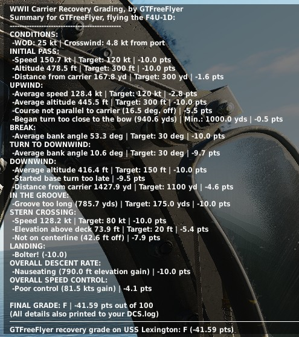  
* Wave-offs will be scored as bolters, and if you re-enter the pattern the proper way (fly upwind, turn left to re-enter the landing pattern), then you will not receive another score when landing.  If you want another scoring attempt, you must enter through the trigger zone again and begin with the initial pass.  
* If you crash, you won't receive a score. Maybe a proper burial at sea, but no score. Don't crash! However, if you want an idea of how you did, review your dcs.log for the play-by-play details. It's located in your ...\Saved Games\DCS\Logs  
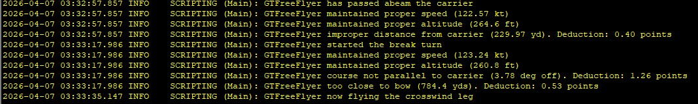  

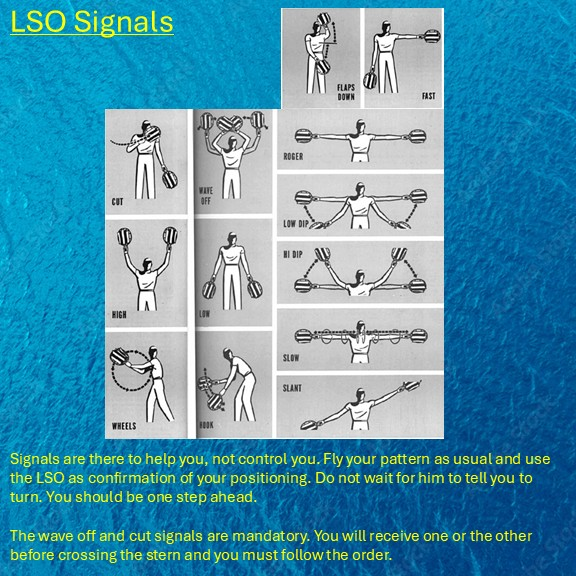
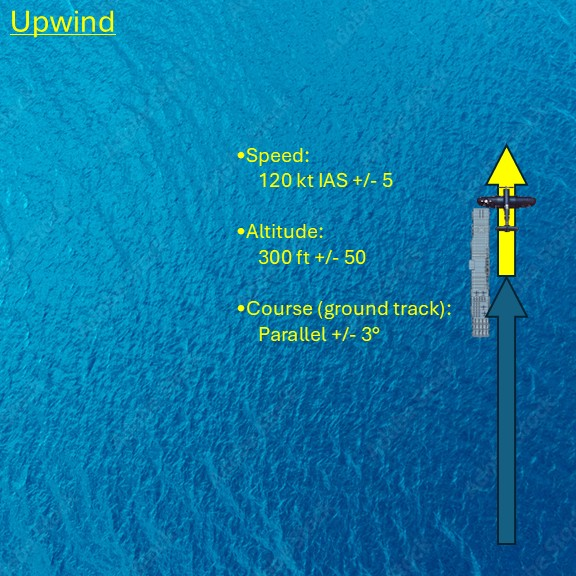
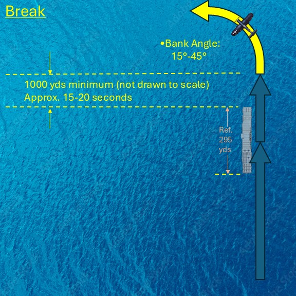

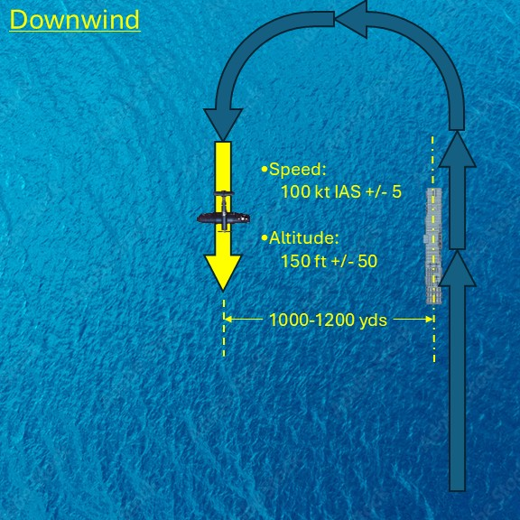

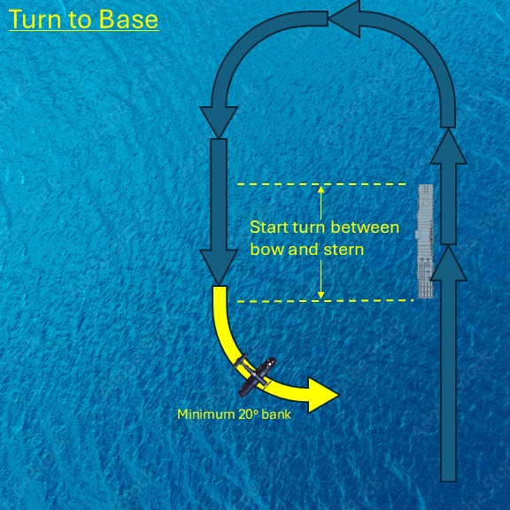
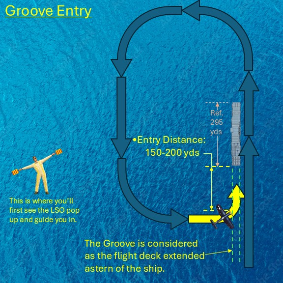
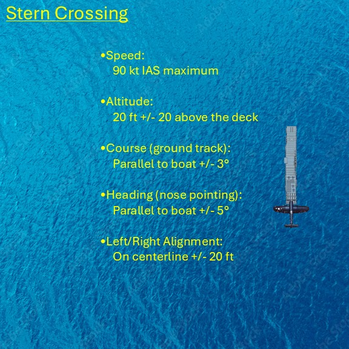
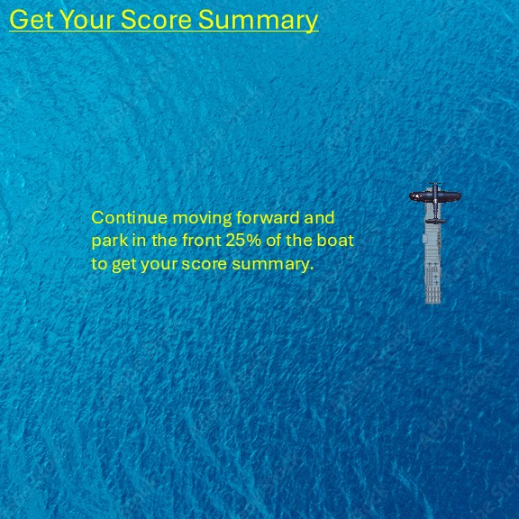
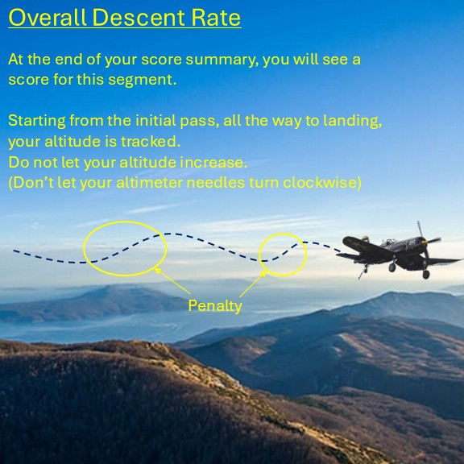

## Technical Info. for Scoring

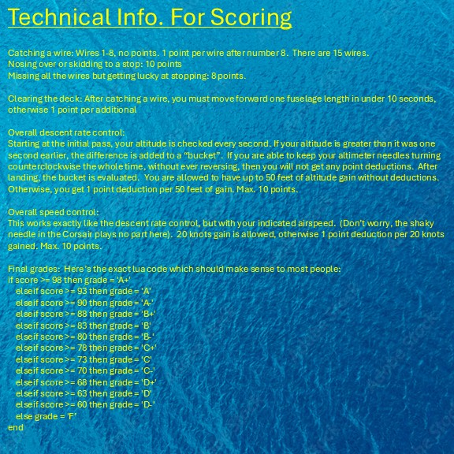

## Carrier Auto-Turn Into the Wind
There's not much to this that isn't already explained in the [Features](#carrier-auto-turn-into-the-wind-feature:) above.  
All you need to do is make sure your carrier has at least one waypoint to go to in the Mission Editor so that it moves along.  
Everything about this feature is automatic.  
You can turn this feature on/off, or exclude specific groups or units if desired.  See step 7 above for the settings you need to define.

## Contact Info:
Contact GTFreeFlyer (Discord or ED Forums) with any questions.  My Discord profile has a link to GT's Runway where you can engage in discussion, and receive update notices, regarding any of my content produced, or use the QR below.

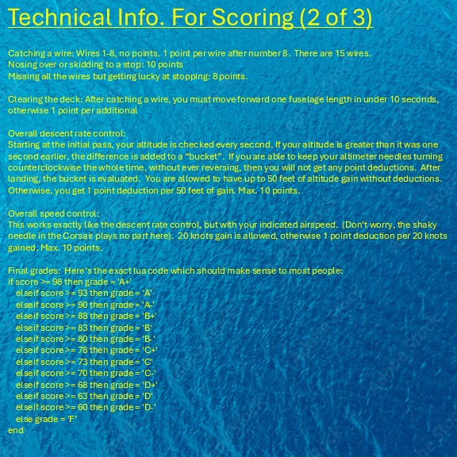

## Forum Thread:  
https://forum.dcs.world/topic/387076-wwii-carrier-recovery-by-gtfreeflyer-grading-script/

## Support Me:  
Scripts like these take many hours for development, debugging, testing, documention, etc. I'm happy to provide my work to the DCS community for free, but of course, I wouldn't be lying if I said a thanks, or a donation, would keep me fueled up for more development :) If you feel that this script has helped you become a better pilot, please keep this in mind.

Patreon: patreon.com/budssquad  
PayPal: gtfreeflyer@yahoo.com  
Venmo: @gtfreeflyer (last 4 for validation are 1484)  

## Credits:
* Inspiration for this from Bankler's Case I Recovery (check it out for modern carrier ops!)
* All lua scripting by GTFreeFlyer
* Consulting by subject matter expert, Foxtrot, Naval Aviation historian at a well-known museum
* Mission testing by Foxtrot and Toro
